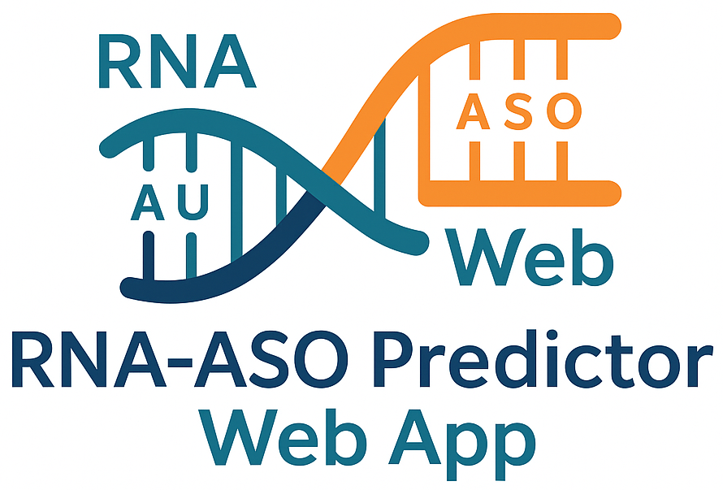

<p align="center">
  
  <p align="center">
    <a href="LICENSE">
      
    </a>
    <a href="https://github.com/HillelCharbit/ASO-web/actions">
      
    </a>
  </p>
</p>

---

## 📖 Abstract

We present an interactive, browser-based interface powered by a deep-learning model for the design of antisense oligonucleotides (ASOs).  
Upon input of a target RNA sequence, the system computes and returns an optimized ASO, streamlined for rapid in-silico screening and experimental planning.  
This tool aims to accelerate ASO discovery workflows in both academic research and therapeutic development.

---

## 🧬 Background

Antisense oligonucleotides (ASOs) are short, synthetic nucleic acid strands that bind complementarily to RNA targets, modulating gene expression.  
ASOs have emerged as promising therapeutics for genetic diseases, viral infections, and splicing disorders.  
Designing optimal ASOs traditionally requires expert heuristics and manual alignment; our deep-learning approach learns sequence features directly from training data, offering an automated, scalable solution.

---

## 🚀 Features

- **Model-driven**: Leverages a pretrained deep-learning architecture to predict high-affinity ASOs  
- **Interactive UI**: Paste or upload RNA sequences and receive ASO recommendations in real time  
- **Customizable**: Adjust prediction parameters (e.g., target window size distribution, random seed for reproducibility)  
- **Open-source**: Written in Python & Flask, easy to extend or integrate into existing pipelines  

---

## 🏗️ Architecture

```mermaid
flowchart LR
    A[Client Browser] --> B(Flask App)
    B --> C{ASOModel}
    C --> D[Deep Learning Model]
    D --> E[ASO Sequence]
    E --> B
    B --> A
